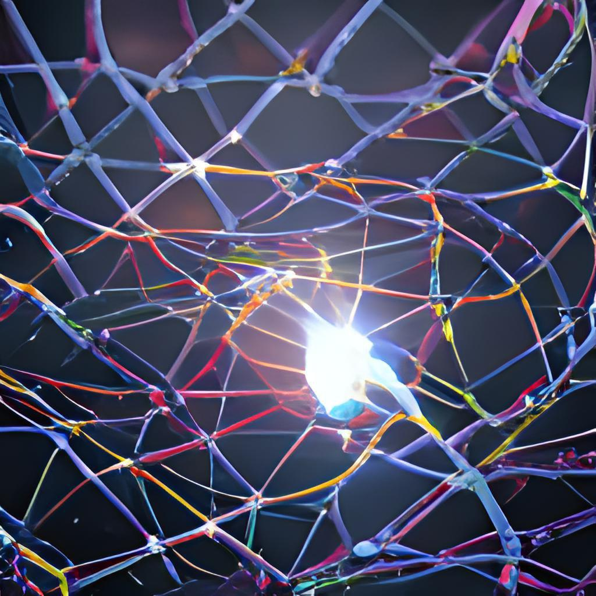

# 006ML Основы нейросетей ч.1

- [Выпуск на anchor.fm](https://anchor.fm/kmsrus/episodes/006-ML----1-ejthqa)
- [Выпуск на Apple подкастах](https://podcasts.apple.com/ru/podcast/machine-learning-podcast/id1495052772?l=en&i=1000491894599)
- [Выпуск на Яндекс.Музыке](https://music.yandex.ru/album/9781458/track/71487762)
- [Выпуск на YouTube](https://youtu.be/mJxFsa2OHbA)

## Описание выпуска:

В 6-м выпуске рассказываю о том, как устроен отдельный нейрон - основной строительный кирпичик нейросетей. Какие задачи он решать может, а какие не может. О том, почему именно нейросети сейчас испытывают такой подъем, среди методов машинного обучения. Как простейший нейрон может выступать в роли логических гейтов и можно ли собрать компьютер полностью на нейросетевой архитектуре. Приятного прослушивания!

## Ссылки выпуска:

- Статья на Хабре "[7 лет хайпа нейросетей в графиках и вдохновляющие перспективы Deep Learning 2020-х](https://habr.com/ru/post/68365/)"
- Статья "[Нейронные сети. Основы](http://synset.com/ai/ru/nn/NeuralNet_01_Intro.html)" с хорошими иллюстрациями
- [Отзыв на книгу](https://habr.com/ru/post/68365/) Петцольда "Код. Тайный язык информатики" на Хабре
- Курс на Coursera "[From NAND to Tetris](https://www.coursera.org/learn/build-a-computer/home/welcome)"
