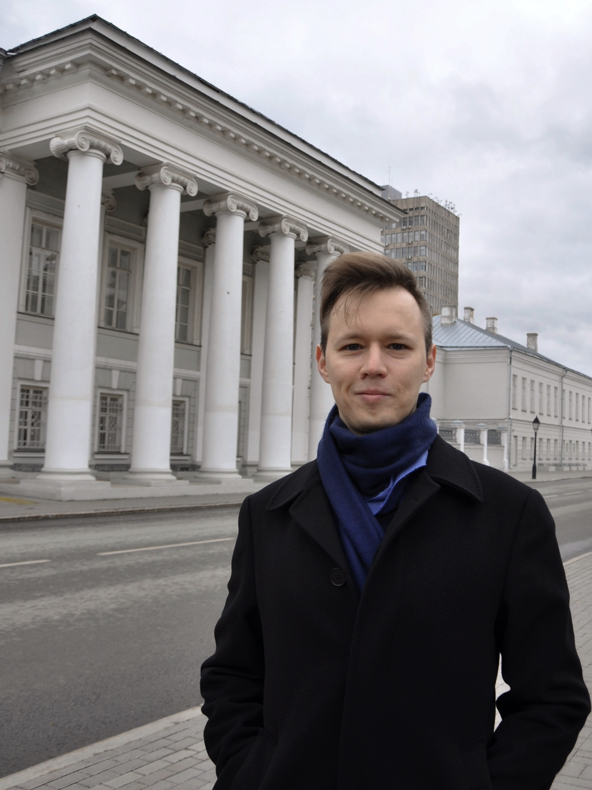

# 007ML Евгений Разинков. Управление коммерческой разработкой в ML

- [Выпуск на anchor.fm](https://anchor.fm/kmsrus/episodes/007-ML--------ML-ekd6bu)
- [Выпуск на Apple подкастах](https://podcasts.apple.com/ru/podcast/machine-learning-podcast/id1495052772?l=en&i=1000493113420)
- [Выпуск на Яндекс.Музыке](https://music.yandex.ru/album/9781458/track/71889949)
- [Выпуск на YouTube](https://youtu.be/QIC6f8CaCEg)

## Описание выпуска:

В этом выпуске в гостях у меня Евгений Разинков - кандидат физико-математических наук, руководитель отдела машинного обучения и компьютерного зрения Группы компаний FIX, директор по науке компании Pr3vision Technologies Inc., старший преподаватель кафедры системного анализа и информационных технологий института ВМиИТ Казанского Федерального Университета. Поговорили про управление командой в коммерческой разработке, обсудили этапы разработки в области машинного обучения, плюсы и минусы профессии дата-сайентиста, перспективы машинного обучения и проблемы, которые сулят нам корпорации, занимающиеся исследованиями и разработками в области машинного обучения и многое другое интересное!

## Ссылки выпуска:

- Курс Стэнфордского университета по сверточным нейронным сетям и распознаванию образов [cs231n](http://cs231n.stanford.edu/)
- Курс Стэнфордского университета по обучению с подкреплением [cs234](http://web.stanford.edu/class/cs234/index.html) 
- Евгений ведет свой YouTube-канал, на котором можно найти отличные [лекции по машинному обучению](http://video.razinkov.ai/), [телеграм-канал](https://t.me/razinkov_ai) с анонсами лекций, видео, материалами по AI, [паблик в ВК](http://vk.com/razinkov_ai), а также [веб-сайт](http://razinkov.ai/), на котором можно найти интересующую информацию о Евгении и его деятельности
