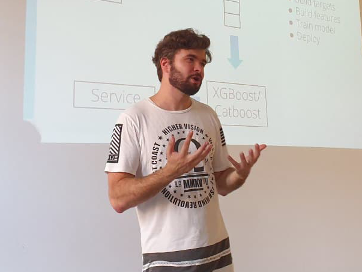

# 011ML Юрий Окуловский. Искусственный Интеллект в мире моды и как подготовиться к Сингулярности

- [Выпуск на anchor.fm](https://anchor.fm/kmsrus/episodes/011-ML-emd8qf)
- [Выпуск на Apple подкастах](https://podcasts.apple.com/ru/podcast/machine-learning-podcast/id1495052772?l=en&i=1000498420602)
- [Выпуск на Яндекс.Музыке](https://music.yandex.ru/album/9781458/track/73579048)
- [Выпуск на YouTube](https://youtu.be/6zNg6P7ABew)

## Описание выпуска:

И снова интереснейший собеседник в эфире подкаста, посвященного машинному обучению! Юрий Окуловский - Senior Data Scientist в Берлине, кандидат физико-математических наук, ранее руководитель лаборатории искусственного интеллекта и робототехники УрФУ и автор нескольких видеокурсов. Поговорили с Юрием про то как алгоритмы постепенно отбирают работу у стилистов, подбирая людям костюмы и аксессуары, про не совсем радужные перспективы человеческого интеллекта, про то захочет ли ИИ осваивать космос и колонизировать экзопланеты, про неизбежность технологической сингулярности и о том, можно ли и нужно ли к ней готовиться. Как всегда - лайк, репост, подписка :)

## Ссылки выпуска:

- Телеграм-канал Юрия "[Свидетели сингулярности](https://t.me/witnessesofsingularity)"
- [Курс по научному мышлению](https://stepik.org/course/578/syllabus) на Степике 
- [Курсы по программированию](https://ulearn.me/) (Юрия и не только)
- Курсы "[Специализация Машинное обучение и анализ данных](https://www.coursera.org/specializations/machine-learning-data-analysis)"
- [Статьи](https://witness-of-singularity.medium.com/) Юрия на Медиуме
