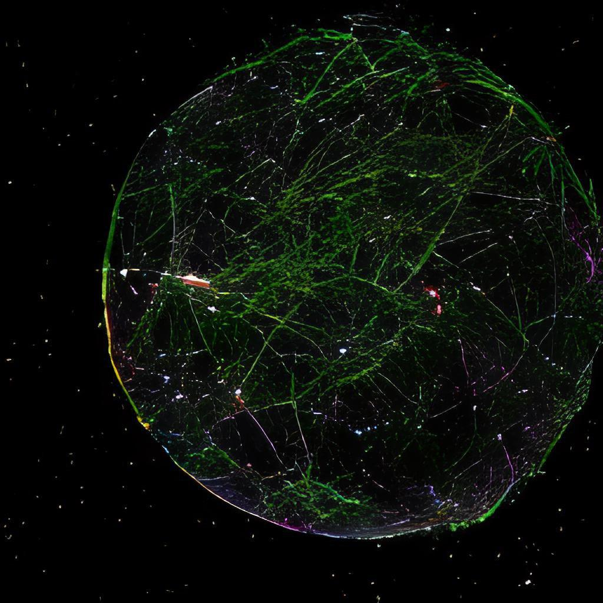

# 015ML Основы нейросетей ч.2 Градиентный спуск

- [Выпуск на anchor.fm](https://anchor.fm/kmsrus/episodes/015-ML----2-enljpl)
- [Выпуск на Apple подкастах](https://podcasts.apple.com/ru/podcast/machine-learning-podcast/id1495052772?l=en&i=1000502043656)
- [Выпуск на Яндекс.Музыке](https://music.yandex.ru/album/9781458/track/74834528)
- [Выпуск на YouTube](https://youtu.be/xGmYSn4b990)

## Описание выпуска:

Продолжаем разговор об основах нейросетей. В этот раз я рассказываю как сеть из простых нейронов может решать сложные задачи. О том, какая математика за всем этим стоит, как строятся сложные многомерные разделяющие поверхности, как обучаются нейросети, что такое градиентный спуск и функция ошибки. Немного затронул темы переобучения и визуализации того, что у нейросетей происходит внутри.

## Ссылки выпуска:

- Выпуск "[Основы нейросетей ч.1](https://anchor.fm/kmsrus/episodes/006-ML----1-ejthqa)", на котором основывается данный
- YouTube канал [3Blue1Brown](https://www.youtube.com/channel/UCYO_jab_esuFRV4b17AJtAw)
- [3Blue1Brown на русском](https://www.youtube.com/channel/UCCbgOIWdmYncvYMbl3LjvBQ)
- [Нейронные сети на Python](https://www.youtube.com/watch?v=nV7cI5zgOpk&list=PLA0M1Bcd0w8yv0XGiF1wjerjSZVSrYbjh) на канале selfedu

Отдельно благодарю за помощь в подготовке выпуска Николая Иванова - гостя 5-го выпуска подкаста за факт-чекинг и разъяснение некоторых нюансов

- [Выпуск с Николаем Ивановым](https://anchor.fm/kmsrus/episodes/005-ML----NLP--GPT-3--Replika-eiibus)
- [Facebook Николая](https://www.facebook.com/nickolas.ivanov)
