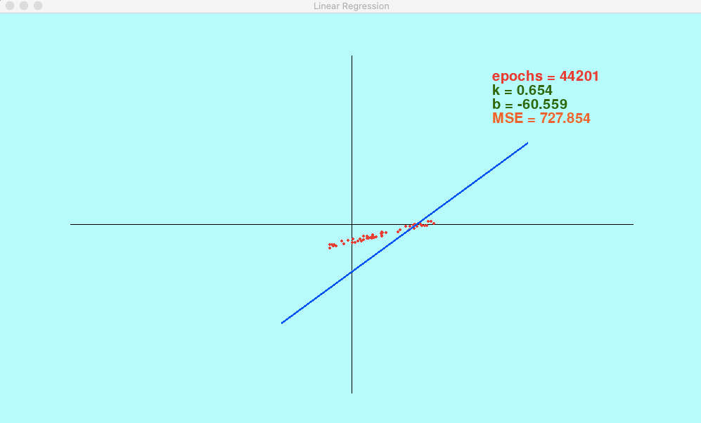

# 016ML Линейная регрессия

- [Выпуск на anchor.fm](https://anchor.fm/kmsrus/episodes/016-ML-eo11mr)
- [Выпуск на Apple подкастах](https://podcasts.apple.com/ru/podcast/machine-learning-podcast/id1495052772?l=en&i=1000502967126)
- [Выпуск на Яндекс.Музыке](https://music.yandex.ru/album/9781458/track/75346293)
- [Выпуск на YouTube](https://youtu.be/Bbvw7mYkVrE)

## Описание выпуска:

С этого метода машинного обучения стоило бы начать сразу, ведь линейная регрессия -  это своего рода "Hello world" машинного обучения. В выпуске я рассказываю про разные подходы к описанию данных (интерполяция, аппроксимация и регрессия) и подробно останавливаюсь на линейной регрессии - как самом простом и наглядном методе обучения с учителем. Также про функцию потерь - среднеквадратичную ошибку, наиболее часто используемую в линейной регрессии, про градиентный спуск в рамках линейной регрессии и про место линейной регрессии среди методов машинного обучения. Казалось бы, причем здесь Марк Твен? Полезного вам прослушивания!

## Ссылки выпуска:

- [Курс Andrew Ng](https://www.coursera.org/learn/machine-learning) на coursera (про линейную регрессию, функцию потерь и градиентный спуск - первая неделя курса)
- Выпуск подкаста [#003 ML Методы машинного обучения](https://anchor.fm/kmsrus/episodes/003-ML-eb2mei)
- Выпуск подкаста [#006 ML Основы нейросетей ч.1](https://anchor.fm/kmsrus/episodes/006-ML----1-ejthqa)
- Выпуск подкаста [#015 ML Основы нейросетей ч.2 Градиентный спуск](https://anchor.fm/kmsrus/episodes/015-ML----2-enljpl)
