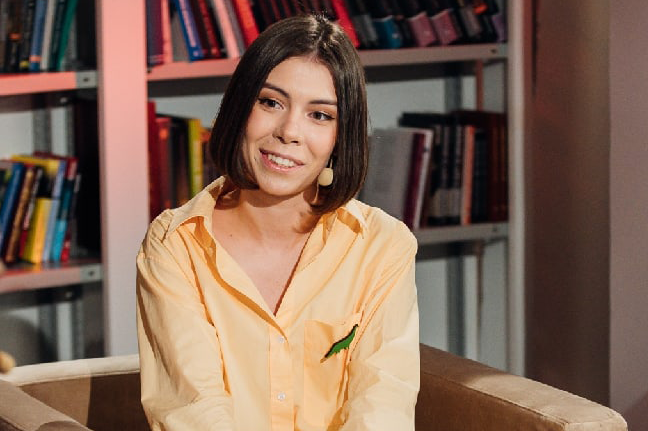

# 017ML Виктория Земляк. ML в научных исследованиях

- [Выпуск на anchor.fm](https://anchor.fm/kmsrus/episodes/017-ML----ML-eo9cd1)
- [Выпуск на Apple подкастах](https://podcasts.apple.com/ru/podcast/machine-learning-podcast/id1495052772?l=en&i=1000503652340)
- [Выпуск на Яндекс.Музыке](https://music.yandex.ru/album/9781458/track/75621748)
- [Выпуск на YouTube](https://youtu.be/FX_J2Ij8fNA)

## Описание выпуска:

В гостях ведущая подкаста о мозге и нейронауках "Нейрочай", специалист по машинному обучению в области NLP, ученая в области нейронаук, Виктория Земляк. Получился очень насыщенный и интересный выпуск, в котором мы обсудили применение машинного обучения в научных исследованиях, айтрекинг (отслеживание взгляда), психолингвистику, ложную слепоту (явление и книгу), различия в связности английских и русских текстов у больных шизофренией, подкастинг, статью Франсуа Шолле про концептуальный подход к созданию сильного ИИ, интеллект воронов и даже нейроинтерфейсы. Однозначно было не скучно!

## Ссылки выпуска:

- [Выпуск](https://anchor.fm/selhozka/episodes/005-enpehl/a-a44cnoa) подкаста "Сельхозка" про искусственный интеллект в сельском хозяйстве
- [Перевод](https://habr.com/ru/company/sberbank/blog/493952/) статьи Франсуа Шолле "Как оценивать интеллект? Подход Google"
- [Оригинал](https://arxiv.org/abs/1911.01547) статьи Франсуа Шолле на Архиве
- Статья на Хабре "[Почему меня разочаровали результаты Kaggle ARC Challenge](https://habr.com/ru/company/sberbank/blog/507852/)"
- [ARC Challenge](https://www.kaggle.com/c/abstraction-and-reasoning-challenge/overview/code-requirements) на Kaggle
- [Статья](https://science.sciencemag.org/content/369/6511/1626) про интеллект у воронов
- Подкаст "[Терминальное чтиво](https://ru.player.fm/series/2395016)"
- [Курс](https://www.coursera.org/specializations/reinforcement-learning) по Reinforcement Learning
- Подкаст "[Нейрочай](https://anchor.fm/neurotea)"
- [Телеграм-канал](https://t.me/neurotea) подкаста "Нейрочай"
- [Паблик подкаста](https://vk.com/neurotea) "Нейрочай" в ВК

#### Мои любимые выпуски подкаста "Нейрочай":

- [Как компьютер понимает речь?](https://anchor.fm/neurotea/episodes/14-eabs5f/a-a1bi28p) (Иван Ямщиков) #14
- [Атака ботов и технооптимизм](https://anchor.fm/neurotea/episodes/15-ean6np/a-a1e3iei) (Иван Ямщиков) #15
- [Как мы помним и забываем](https://anchor.fm/neurotea/episodes/11-e9a1t9/a-a13jocj) (Полина Кривых) #11
