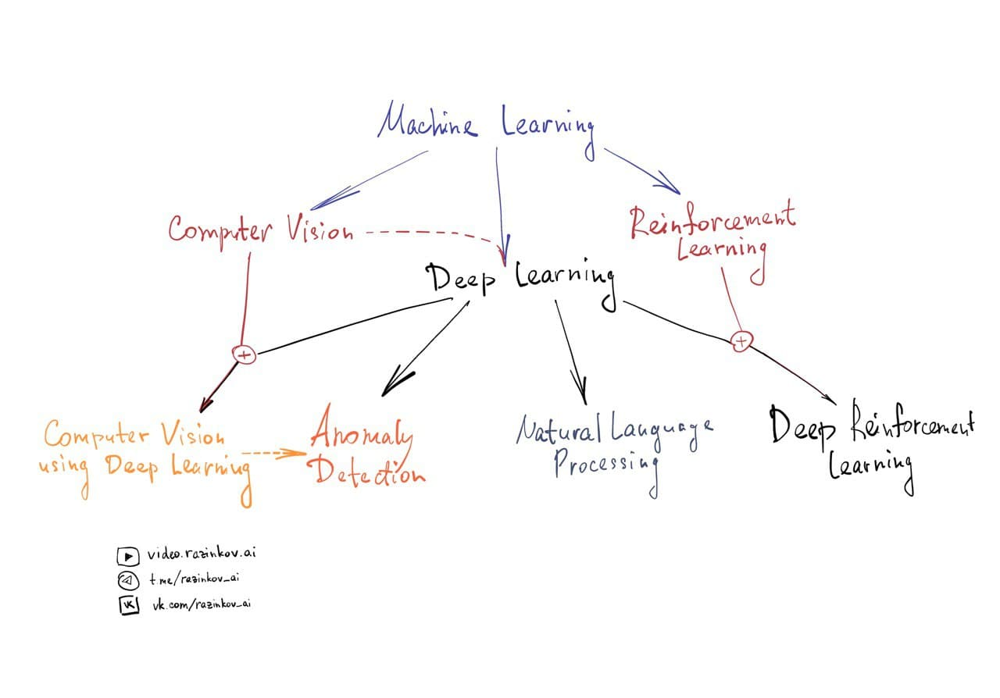

# 019ML Евгений Разинков. Дорожная карта погружения в машинное обучение ч.2

- [Выпуск на anchor.fm](https://anchor.fm/kmsrus/episodes/019-ML-----------2-eopssg)
- [Выпуск на Apple подкастах](https://podcasts.apple.com/ru/podcast/machine-learning-podcast/id1495052772?l=en&i=1000504925050)
- [Выпуск на Яндекс.Музыке](https://music.yandex.ru/album/9781458/track/76097161)
- [Выпуск на YouTube](https://youtu.be/12-54cVdyGs)

## Описание выпуска:

Продолжаем рисование дорожной карты погружения в машинное обучение, начатое в прошлом выпуске, вместе с кандидатом физико-математических наук, профессиональным преподавателем машинного обучения кафедры системного анализа и информационных технологий института ВМиИТ Казанского Федерального Университета, Евгением Разинковым. На мой взгляд, ценность того, что рассказывает Евгений обусловлена также и тем, что он не просто преподаватель-теоретик, он еще и востребованный действующий специалист в индустрии. Евгений  руководит отделом машинного обучения и компьютерного зрения Группы компаний FIX, а также является директором по науке в компании Pr3vision Technologies Inc. В выпуске Евгений рассказал какие есть направления в машинном обучении и в какой последовательности имеет смысл их изучать, поделился своим видением какая математика нужна в изучении ML, почему недооценено обучение с подкреплением и есть ли перспективы у GANов. А также детально обосновал свой выбор между TenzorFlow и PyTorch. Было интересно и полезно!

## Ссылки выпуска:

- [Первая часть выпуска](https://anchor.fm/kmsrus/episodes/018-ML-----------1-eoftu6) с Евгением Разинковым "Дорожная карта погружения в машинное обучение"

Напоминаю, что Евгений ведет свой [YouTube-канал](http://video.razinkov.ai/), на котором можно найти отличные лекции по машинному обучению, [телеграм-канал](https://t.me/razinkov_ai) с анонсами лекций, видео, материалами по AI, [паблик в ВК](http://vk.com/razinkov_ai), а также [веб-сайт](http://razinkov.ai/), на котором можно найти интересующую информацию о Евгении и его деятельности.
