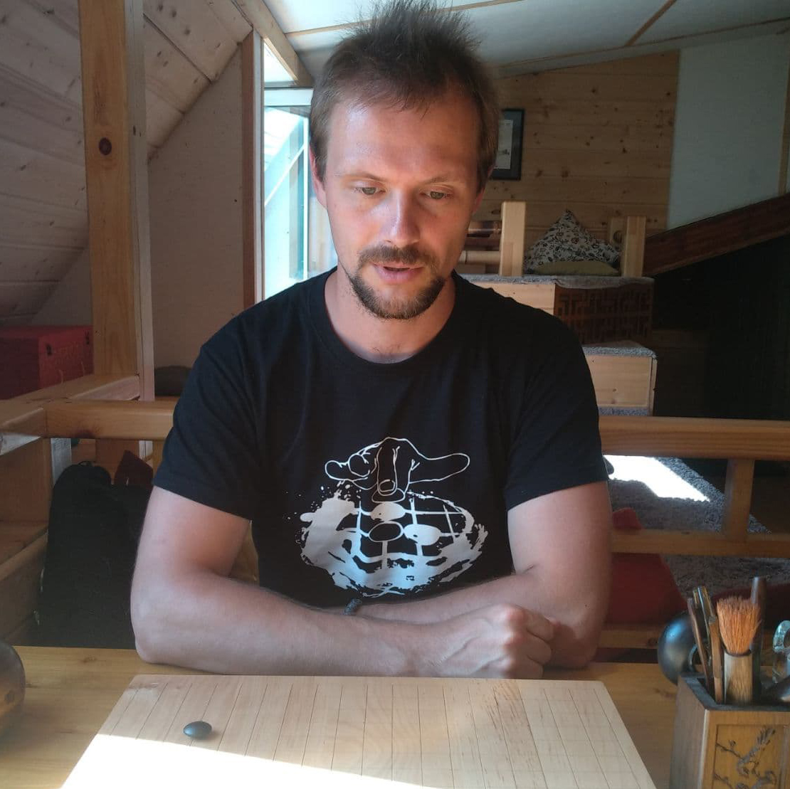

# 021ML Алексей Нечаев. AlphaGo и философия игры Го

- [Выпуск на anchor.fm](https://anchor.fm/kmsrus/episodes/021-ML----AlphaGo-epaapa)
- [Выпуск на Apple подкастах](https://podcasts.apple.com/ru/podcast/machine-learning-podcast/id1495052772?l=en&i=1000506158006)
- [Выпуск на Яндекс.Музыке](https://music.yandex.ru/album/9781458/track/76915180)
- [Выпуск на YouTube](https://youtu.be/Gk1OeLsuljE)

## Описание выпуска:

Победа AlphaGo над чемпионом мира по игре го Ли Седолем в 2016 году стала поистине знаковым событием в мире машинного обучения. Ведь большинство экспертов сходились во мнении, что до победы компьютера над человеком в го еще лет десять. Это первый выпуск, посвященный игре го, в котором я беседую с профессиональным преподавателем го Алексеем Нечаевым. Алексей рассказал про правила и философию игры, про то, почему компьютеры до 2016 года плохо играли в го и не могли составить конкуренцию игрокам-людям, про то, как повлияла на игру победа AlphaGo и про многое-многое другое.

## Ссылки выпуска:

- Фильм "[AlphaGo](https://youtu.be/WXuK6gekU1Y)"
- Фильм "AlphaGo" ([русский перевод](https://youtu.be/HqaYiMMUc44))
- [Школа Го Алексея Нечаева](https://vk.com/weiqi_school) ВКонтакте
- [Сайт](http://igo.mya5.ru/) Алексея Нечаева
- [YouTube-канал](https://www.youtube.com/channel/UCopu-zXy2k9zMwTalWFEskQ) Алексея Нечаева
- [Алексей Нечаев](https://www.twitch.tv/alone_go) на твиче
- Книга "[Го и восточная бизнес-стратегия](https://nikoraido.ru/files/Miura-YAsuyuki-Go-i-vostochnaya-biznes-strategiya.pdf)"
- [Российская федерация го](https://gofederation.ru/)
- [Статья](https://ru.wikipedia.org/wiki/%D0%93%D0%BE) в Википедии про го
- [Хикару и го](https://www.youtube.com/watch?v=oTIrluqSac4&list=PLj-9n6opiLUFZLXpRyWQP4k80EQAjViMl)
- [KGS Go Server](http://www.gokgs.com/)
- [Online Go Server](https://online-go.com/)
