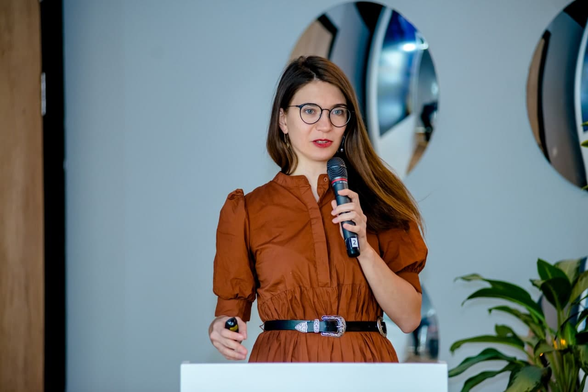

# 023ML Ольга Перепелкина. Про федеративное обучение и распознавание эмоций

- [Выпуск на anchor.fm](https://anchor.fm/kmsrus/episodes/023-ML-eutiao)
- [Выпуск на Apple подкастах](https://podcasts.apple.com/ru/podcast/machine-learning-podcast/id1495052772?l=en&i=1000517183050)
- [Выпуск на Яндекс.Музыке](https://music.yandex.ru/album/9781458/track/80980307)
- [Выпуск на YouTube](https://youtu.be/BUfSQu9gSzI)

## Описание выпуска:

В очередном выпуске беседа с Ольгой Перепелкиной Deep Learning Product Manager компании Intel. Для того, чтобы машинное обучение было эффективным - ему нужны данные и чем больше, тем лучше. Но чем быстрее развивается искусственный интеллект, тем жестче становятся законы о защите персональных данных. Проблема? Да, проблема. Но где есть проблема, там находятся и решения и федеративное обучение - одно из таких, позволяющих и приватность сохранить и модели обучить. Об этом, а также о подходах к распознаванию эмоций и карьерном пути в ML слушайте в выпуске!

## Ссылки выпуска:

[OpenFL](https://github.com/intel/openfl) - опенсорс библиотека для федеративного обучения (Federated Learning)
