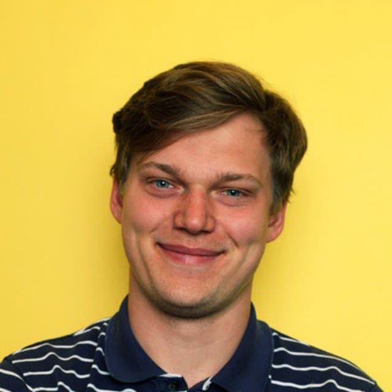

# 027ML Петр Ермаков. ODS - русскоязычное сообщество дата-сайентистов

- [Выпуск на anchor.fm](https://anchor.fm/kmsrus/episodes/027-ML----ODS-------e1444kc)
- [Выпуск на Apple подкастах](https://podcasts.apple.com/ru/podcast/machine-learning-podcast/id1495052772?l=en&i=1000528212247)
- [Выпуск на Яндекс.Музыке](https://music.yandex.ru/album/9781458/track/86839834)
- [Выпуск на YouTube](https://youtu.be/vhdJPVc3Uh4)

## Описание выпуска:

Всегда полезно иметь доступ к сообществу профессионалов и любителей темы, которая входит в круг ваших интересов. Профессионалы и любители данных, машинного обучения, искусственного интеллекта и так далее в русскоязычном сегменте имеют крутейшее сообщество, известное как Open Data Science или ODS. В этом выпуске поговорили с Петром Ермаковым - основателем школы машинного обучения DataGym и Senior Data Scientist компании lamoda - о том, как появился ODS, как развивался, зачем туда вступать, как там себя вести и какую пользу можно извлечь из участия в сообществе. Также вы узнаете зачем анализировать профили ВКонтакте и PornHub, как заниматься Data Science если вокруг тебя только волки, как "отжать" у мэйла сайт крупного митапа и как понять, что ты деградируешь, анализируя данные с фитнес-браслетов.

## Ссылки выпуска:

- [ODS](https://ods.ai/)
- Статья на Хабре "[Уроки участия в хакатоне «Dota Science» в рамках Data Fest 2](https://m.habr.com/ru/post/278785/)"
- Школа машинного обучения [DataGym](https://datagym.ru/)
- [Телеграм-канал](http://t.me/powerofdata) Петра
